Box Office Revenue Prediction Project
================
Tillman Degens
5/8/2021

This project attempts to build a model that predicts a films box office
revenue, using data on movies from The Movie Database (TMDB). To do this
it uses a linear regression, lasso regression, ridge regression, elastic
net regression, and random forest regression. The project finds that
most successful models are linear regression and random forest
regression. The results could be useful to movie studios or film
enthusiasts.

One of the hardest hit industries by the Covid-19 pandemic, Hollywood is
looking for its place in the modern economy. Several studios have
already decided to move their film slates entirely digital, with
hundreds of other films currently in limbo. For this reason, it is
increasingly important for studios to project what movies will succeed
at the box office and what movies are better off released to streaming
service. In addition to studio interest, box office revenues have proven
to be of interest to the public. Each week the Wall Street Journal
includes a segment on the box office results, and there are even
“Fantasy Movie Leagues” like fantasy sports. This project would be of
interest to each of these demographics, as it takes publicly available
data on movie characteristics and aims to create a model that accurately
predicts box office revenues.

This project used three datasets: tmdb-box-office-projections, ratings,
and GDP deflator. The primary data was from the TMDB box office
prediction challenge in Kaggle. This data was scraped from TMDB (The
Movie Database) using an open API. The data frame was then joined with
the ratings dataset, which came from the same database, to include
average IMDB rating for each film. Lastly, the data was joined by year
with the GDP deflator obtained from the Saint Louis Federal Reserve.
This was used to adjust the revenue and budget values to 2012 dollars.
The first step in developing a usable predictive model was cleaning the
data to manufacture new variables. For example, the “Cast” variable in
the initial data frame was a string of all actors who had worked on the
film in a JSON format. The separate() function was used to isolate the
gender of the main character, which was then used a predictor. A similar
approach was taken for the variable genre, where the two main genres for
each film were isolated. Next a binary variable was created for if
either the first or second genre fell into a specific category (action,
comedy, etc.). The release date variable was broken into year (a
continuous numerical value) and month (a categorical value). Lastly, to
prepare the data for analysis, both monetary variables, budget and
revenue were divided by the GDP deflator in the year they were released.

The data proved difficult to process. The original dataset contained
3000 films, but the final clean dataset had only 1,454 observations.
This was primarily because there were 1335 films removed which were
missing an average IMDB rating. In addition, the data contained
predominantly films grossing less that 50 million dollars. This meant
that the model performed significantly better when the outliers, the
highest grossing films were removed. However, I elected to keep the
highest grossing films in the model as they are the most important to
movie studios.

Four learning methods were applied to the data: lasso regression, ridge
regression, elastic net regression, and random forest regression. These
were compared against the control model which was a linear regression
containing all predictors. The parameters for lasso and ridge regression
were tuned using 10-fold cross validation, with the best model
representing the lowest RMSE. The λ values were 2310129 and 0
(practically), respectively. For the elastic net model, alpha, a mixture
of ridge and lasso regression was added. The λ value was 1.4e10 and the
mixture was 0.2. The random forests regression was tuned using bootstrap
cross validation with the best model representing the lowest RMSE as
well. It was tuned for the number of variables randomly sampled, which
was 8 and the minimum datapoints required for a node to be split, which
was 2.

The results indicate that the optimal penalty (λ) would have been zero
as the linear model outperformed the lasso, ridge, and elastic net
regressions with an RMSE of 99 million. The model’s success was measured
as the RMSE when evaluated on the test data. The underperformance of the
tuned linear models indicates that I included too many options for λ and
overfit the training data. It also indicates that it is difficult to
accurately predict revenue given the dataset. The best performing model
was the random forest regression which had an RMSE of 92 million. The
accuracy of the model could have been greatly improved had the outliers
been removed, but this would have further decreased the usefulness of
the results. Ultimately given the publicly available data it is very
difficult to accurately predict box office revenues.

## Loading in Data

The two datasets used were tmdb-box-office-projections and ratings. The
tmdb data was from the box office prediction challenge in kaggle, while
the ratings and runtime were scraped in through the same API (not
included in the competition data). I added them to increase the the
accurercy of the model. I elected not to use the much larger ratings
dataset because I assume that the Kaggle competition contains more
accurate data.

``` r
#Load packages and data
library(pacman)

p_load(tidyverse, modeldata, skimr, janitor, kknn, tidymodels, magrittr, glmnet,ggplot2, lubridate, priceR, dplyr, naniar, vip)

setwd("C:/Users/tillm/OneDrive/Desktop/Github")
revenue_data = "train.csv" %>% read_csv()
ratings = "Ratings.csv" %>% read_csv()
```

## Quick Overview

``` r
glimpse(revenue_data)
```

    ## Rows: 3,000
    ## Columns: 23
    ## $ id                    <dbl> 1, 2, 3, 4, 5, 6, 7, 8, 9, 10, 11, 12, 13, 14, 1~
    ## $ belongs_to_collection <chr> "[{'id': 313576, 'name': 'Hot Tub Time Machine C~
    ## $ budget                <dbl> 1.40e+07, 4.00e+07, 3.30e+06, 1.20e+06, 0.00e+00~
    ## $ genres                <chr> "[{'id': 35, 'name': 'Comedy'}]", "[{'id': 35, '~
    ## $ homepage              <chr> NA, NA, "http://sonyclassics.com/whiplash/", "ht~
    ## $ imdb_id               <chr> "tt2637294", "tt0368933", "tt2582802", "tt182148~
    ## $ original_language     <chr> "en", "en", "en", "hi", "ko", "en", "en", "en", ~
    ## $ original_title        <chr> "Hot Tub Time Machine 2", "The Princess Diaries ~
    ## $ overview              <chr> "When Lou, who has become the \"father of the In~
    ## $ popularity            <dbl> 6.575393, 8.248895, 64.299990, 3.174936, 1.14807~
    ## $ poster_path           <chr> "/tQtWuwvMf0hCc2QR2tkolwl7c3c.jpg", "/w9Z7A0GHEh~
    ## $ production_companies  <chr> "[{'name': 'Paramount Pictures', 'id': 4}, {'nam~
    ## $ production_countries  <chr> "[{'iso_3166_1': 'US', 'name': 'United States of~
    ## $ release_date          <chr> "2/20/15", "8/6/04", "10/10/14", "3/9/12", "2/5/~
    ## $ runtime               <dbl> 93, 113, 105, 122, 118, 83, 92, 84, 100, 91, 119~
    ## $ spoken_languages      <chr> "[{'iso_639_1': 'en', 'name': 'English'}]", "[{'~
    ## $ status                <chr> "Released", "Released", "Released", "Released", ~
    ## $ tagline               <chr> "The Laws of Space and Time are About to be Viol~
    ## $ title                 <chr> "Hot Tub Time Machine 2", "The Princess Diaries ~
    ## $ Keywords              <chr> "[{'id': 4379, 'name': 'time travel'}, {'id': 96~
    ## $ cast                  <chr> "[{'cast_id': 4, 'character': 'Lou', 'credit_id'~
    ## $ crew                  <chr> "[{'credit_id': '59ac067c92514107af02c8c8', 'dep~
    ## $ revenue               <dbl> 12314651, 95149435, 13092000, 16000000, 3923970,~

``` r
glimpse(ratings)
```

    ## Rows: 45,466
    ## Columns: 24
    ## $ adult                 <lgl> FALSE, FALSE, FALSE, FALSE, FALSE, FALSE, FALSE,~
    ## $ belongs_to_collection <chr> "{'id': 10194, 'name': 'Toy Story Collection', '~
    ## $ budget                <dbl> 30000000, 65000000, 0, 16000000, 0, 60000000, 58~
    ## $ genres                <chr> "[{'id': 16, 'name': 'Animation'}, {'id': 35, 'n~
    ## $ homepage              <chr> "http://toystory.disney.com/toy-story", NA, NA, ~
    ## $ id                    <dbl> 862, 8844, 15602, 31357, 11862, 949, 11860, 4532~
    ## $ imdb_id               <chr> "tt0114709", "tt0113497", "tt0113228", "tt011488~
    ## $ original_language     <chr> "en", "en", "en", "en", "en", "en", "en", "en", ~
    ## $ original_title        <chr> "Toy Story", "Jumanji", "Grumpier Old Men", "Wai~
    ## $ overview              <chr> "Led by Woody, Andy's toys live happily in his r~
    ## $ popularity            <dbl> 21.946943, 17.015539, 11.712900, 3.859495, 8.387~
    ## $ poster_path           <chr> "/rhIRbceoE9lR4veEXuwCC2wARtG.jpg", "/vzmL6fP7aP~
    ## $ production_companies  <chr> "[{'name': 'Pixar Animation Studios', 'id': 3}]"~
    ## $ production_countries  <chr> "[{'iso_3166_1': 'US', 'name': 'United States of~
    ## $ release_date          <chr> "10/30/1995", "12/15/1995", "12/22/1995", "12/22~
    ## $ revenue               <dbl> 373554033, 262797249, 0, 81452156, 76578911, 187~
    ## $ runtime               <dbl> 81, 104, 101, 127, 106, 170, 127, 97, 106, 130, ~
    ## $ spoken_languages      <chr> "[{'iso_639_1': 'en', 'name': 'English'}]", "[{'~
    ## $ status                <chr> "Released", "Released", "Released", "Released", ~
    ## $ tagline               <chr> NA, "Roll the dice and unleash the excitement!",~
    ## $ title                 <chr> "Toy Story", "Jumanji", "Grumpier Old Men", "Wai~
    ## $ video                 <lgl> FALSE, FALSE, FALSE, FALSE, FALSE, FALSE, FALSE,~
    ## $ vote_average          <dbl> 7.7, 6.9, 6.5, 6.1, 5.7, 7.7, 6.2, 5.4, 5.5, 6.6~
    ## $ vote_count            <dbl> 5415, 2413, 92, 34, 173, 1886, 141, 45, 174, 119~

## Joining the Datasets

Only need runtime, and rating from the rating df. Originally tried by
joinging on original\_title. Read through the documentation to figure
out the issue. What happened was the data was joined by title but some
movies are remakes and others just have the same title. For example both
Ralph Machio and Jaden smith starred in “The Karate Kid”.Read through
the documentation to figure out the issue. Have to join by id (somehow
missed it on first look through).

Because there are so many more variables in the ratings dataset it will
be interesting to see whether more data or more predictors will have a
larger impact on the accuracy of the model.

## Joining Data for Vote\_Average and Vote\_Count Variable

``` r
ratings = ratings %>%
select(vote_average, id)
movies = revenue_data %>% 
left_join(ratings, by = "id")

sum(is.na(movies$vote_average))
```

    ## [1] 1335

``` r
#Have to remove all NA for vote average, 1335 is too many to immpuatate.

movies = movies %>%
filter(!is.na(vote_average))
```

The number of observations is now down to 1665

## Filter Out Unreleased Films

Because it is of no use to predict revenues for unreleased films those
will also need to be filtered out.

``` r
movies = movies %>% filter(status == "Released")
#This removes one film
```

## Manipulate Data to Create New Variables

Because there is a lack of predictor variables and many are unusable,
for example cast where an observation looks like this: ‘cast\_id’: 4,
‘character’: ‘Lou’, ‘credit\_id’: ‘52fe4ee7c3a36847f82afae7’,
‘gender’: 2, ‘id’: 52997, ‘name’: ‘Rob Corddry’, ‘order’: 0,
‘profile\_path’: ‘/k2zJL0V1nEZuFT08xUdOd3ucfXz.jpg’}, {‘cast\_id’: 5,
‘character’: ‘Nick’, ‘credit\_id’: ‘52fe4ee7c3a36847f82afaeb’,
‘gender’: 2, ‘id’: 64342, ‘name’: ‘Craig Robinson’, ‘order’: 1,
‘profile\_path’: ‘/tVaRMkJXOEVhYxtnnFuhqW0Rjzz.jpg’}, {‘cast\_id’: 6,
‘character’: ‘Jacob’, ‘credit\_id’: ‘52fe4ee7c3a36847f82afaef’,
‘gender’: 2, ‘id’: 54729, ‘name’: ‘Clark Duke’, ‘order’: 2,
‘profile\_path’: ‘/oNzK0umwm5Wn0wyEbOy6TVJCSBn.jpg’}, {‘cast\_id’: 7,
‘character’: ‘Adam Jr.’, ‘credit\_id’: ‘52fe4ee7c3a36847f82afaf3’,
‘gender’: 2, ‘id’: 36801, ‘name’: ‘Adam Scott’, ‘order’: 3,
‘profile\_path’: ‘/5gb65xz8bzd42yjMAl4zwo4cvKw.jpg’}, {‘cast\_id’: 8,
‘character’: ‘Hot Tub Repairman’, ‘credit\_id’:
‘52fe4ee7c3a36847f82afaf7’, ‘gender’: 2, ‘id’: 54812, ‘name’: ‘Chevy
Chase’, ‘order’: 4, ‘profile\_path’:
‘/svjpyYtPwtjvRxX9IZnOmOkhDOt.jpg’}, {‘cast\_id’: 9, ‘character’:
‘Jill’, ‘credit\_id’: ‘52fe4ee7c3a36847f82afafb’, ‘gender’: 1, ‘id’:
94098, ‘name’: ‘Gillian Jacobs’, ‘order’: 5, ‘profile\_path’:
‘/rBnhe5vhNPnhRUdtYahBWx90fJM.jpg’}, {‘cast\_id’: 10, ‘character’:
‘Sophie’, ‘credit\_id’: ‘52fe4ee7c3a36847f82afaff’, ‘gender’: 1, ‘id’:
, ‘name’: ‘Bianca Haase’, ‘order’: 6, ‘profile\_path’:)

we need to manipulate some of the variables into something usable.

New variables created are:

Gender of main character (actor). Dummy variable for whether the main
character is a male or female. This is NA if the characters gender is
undefined, for example in the case of a tree in an animated film.

Month released. Movie studios are continuously competing over when they
release a movie. Late spring and early summer is typically reserved for
blockbusters, as well as December/January because kids are out of
school. Movie studios typically release their best movies in
October/November as “Oscar bait” so they are fresh on audiences/judges
minds during the academy awards. There are numerous other seasonal
trends in the movie release schedule.

Language: I am changing this from the language to an English/foreign
binary variable due to the tiny sample size for many languages.

Genre: First must separate genres out into dummy variables. Also create
a new variable for more than 2 genres.

``` r
#Get gender of main character
movies= separate(movies, cast, c("drop", "gender"), sep = "'gender':") #Text to columns

#head(movies$gender)

#seperate again to isolate gender
movies = separate(movies, gender, c("gender","drop"), sep = ",")

#Change gender to numeric
movies = movies %>%
mutate(gender = as.numeric(gender))

#Filter out non gender characters or missing for the simplicity of the model
movies= movies%>% filter(gender == 1 | gender == 2)
#Reduces dataset to 1527 rows

#Switch gender to male/female
movies = movies %>% mutate(gender = case_when( gender == 1 ~ "female", gender == 2 ~ "male" ))

gender = movies %>%
mutate(gender = as.factor(gender))%>% ggplot(aes(gender, revenue))+geom_boxplot() #Look at relationship between gender and revenue
gender
```

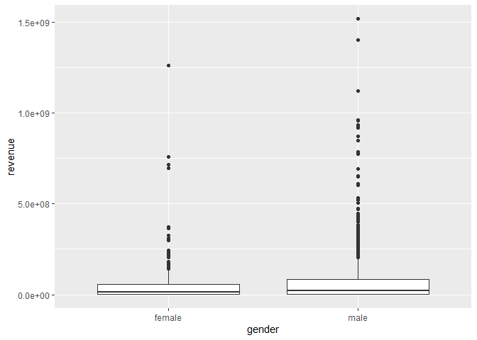<!-- -->

``` r
gender = movies %>%
mutate(gender = as.factor(gender))%>% ggplot(aes(gender, budget))+geom_boxplot() #Look at relationship between gender and budget
gender
```

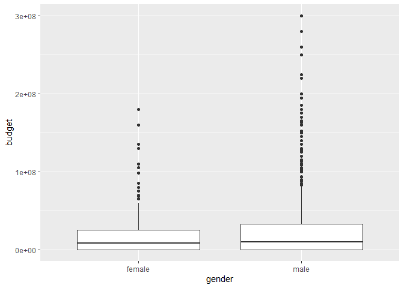<!-- -->

Appears to be a slight relationship between casting a male lead and box
office revenues. This is most likely due to studio bias in casting males
in blockbuster movies.(This is the same relationship as budget).

## Genre

``` r
#Change genres
movies= separate(movies, genres, c("drop1", "genre1", "genre2", "genre3"), sep = "'name': '")
movies= separate(movies, genre1, c("genre1"), sep = "'}")
movies= separate(movies, genre2, c("genre2"), sep = "'}")

#Create variable for more than 2 genres
movies = movies %>%
mutate(morethantwogenre = if_else(!is.na(genre3), 1, 0))

#Check the genre types
unique(movies$genre1)
```

    ##  [1] "Comedy"          "Drama"           "Action"          "Animation"      
    ##  [5] "Horror"          "Adventure"       "Thriller"        "Crime"          
    ##  [9] "Fantasy"         "Music"           "War"             "Documentary"    
    ## [13] "Mystery"         "Romance"         "Family"          "Science Fiction"
    ## [17] NA                "Western"         "Foreign"         "History"        
    ## [21] "TV Movie"

``` r
unique(movies$genre2)
```

    ##  [1] "Drama"           NA                "Thriller"        "Adventure"      
    ##  [5] "Crime"           "Romance"         "Family"          "Mystery"        
    ##  [9] "Comedy"          "Horror"          "Action"          "Fantasy"        
    ## [13] "Music"           "History"         "Animation"       "Science Fiction"
    ## [17] "Western"         "War"             "Documentary"     "Foreign"

``` r
#See if they match
n_distinct(movies$genre1)
```

    ## [1] 21

``` r
n_distinct(movies$genre2)
```

    ## [1] 20

``` r
#Count number of each value
movies %>% count(genre1)
```

    ## # A tibble: 21 x 2
    ##    genre1          n
    ##  * <chr>       <int>
    ##  1 Action        276
    ##  2 Adventure      89
    ##  3 Animation      33
    ##  4 Comedy        326
    ##  5 Crime          77
    ##  6 Documentary    20
    ##  7 Drama         394
    ##  8 Family         16
    ##  9 Fantasy        35
    ## 10 Foreign         1
    ## # ... with 11 more rows

``` r
movies %>% count(genre2)
```

    ## # A tibble: 20 x 2
    ##    genre2              n
    ##  * <chr>           <int>
    ##  1 Action             78
    ##  2 Adventure          86
    ##  3 Animation          19
    ##  4 Comedy            148
    ##  5 Crime              90
    ##  6 Documentary         5
    ##  7 Drama             269
    ##  8 Family             44
    ##  9 Fantasy            41
    ## 10 Foreign             4
    ## 11 History            32
    ## 12 Horror             41
    ## 13 Music              22
    ## 14 Mystery            36
    ## 15 Romance           123
    ## 16 Science Fiction    29
    ## 17 Thriller          137
    ## 18 War                13
    ## 19 Western             6
    ## 20 NA                304

``` r
#Create Dummy Vars
movies = movies %>% mutate(genre1 = if_else(is.na(genre1), "0", genre1))
movies = movies %>% mutate(genre2 = if_else(is.na(genre2), "0", genre2))

#Create Binary Variables for all genres with more than 40 observations.
movies1 = movies %>% mutate(Comedy = if_else(genre1 == "Comedy" | genre2 == "Comedy", 1, 0))%>%
mutate(Drama = if_else(genre1 == "Drama" | genre2 == "Drama", 1, 0))%>%
mutate(Thriller = if_else(genre1 == "Thriller" | genre2 == "Thriller", 1, 0))%>%
mutate(Action = if_else(genre1 == "Action" | genre2 == "Action", 1, 0))%>%
mutate(Animation = if_else(genre1 == "Animation" | genre2 == "Animation", 1, 0))%>%
mutate(Horror = if_else(genre1 == "Horror" | genre2 == "Horror", 1, 0))%>%
mutate(Documentary = if_else(genre1 == "Documentary" | genre2 == "Documentary", 1, 0))%>%
mutate(Adventure = if_else(genre1 == "Adventure" | genre2 == "Adventure", 1, 0))%>%
mutate(Crime = if_else(genre1 == "Crime" | genre2 == "Crime", 1, 0))%>%
mutate(Mystery = if_else(genre1 == "Mystery" | genre2 == "Mystery", 1, 0))%>%
mutate(Fantasy = if_else(genre1 == "Fantasy" | genre2 == "Fantasy", 1, 0))%>%
mutate(Science_Fiction = if_else(genre1 == "Science Fiction" | genre2 == "Science Fiction", 1, 0))%>%
mutate(Romance = if_else(genre1 == "Romance" | genre2 == "Romance", 1, 0))%>%
mutate(Music = if_else(genre1 == "Music" | genre2 == "Music", 1, 0))%>%
mutate(Family = if_else(genre1 == "Family" | genre2 == "Family", 1, 0))%>%
mutate(History = if_else(genre1 == "History" | genre2 == "History", 1, 0))
```

## Turn Date Released into Month and Year

``` r
#Change date into year and month released
movies2 = movies1 %>% mutate(release_date = as.Date(release_date, "%m/%d/%y"))%>% mutate(month = strftime(release_date, "%m"))%>%
mutate(year = strftime(release_date, "%Y"))

#change year into a coninuous variable
movies2 = movies2 %>% mutate(year= as.numeric(year))
```

## Change Language to English/Foreign Binary Variable

``` r
movies2 = movies2 %>% mutate(original_language = if_else(original_language == "en", 1, 0))
```

## Adjust Revenue and Budget for Inflation

``` r
setwd("C:/Users/tillm/OneDrive/Desktop/Github")
#Read in CSV to adjust to 2012 dollars taken from St. Louis Fed
gdp = "GDP.csv" %>% read_csv

glimpse(gdp)
```

    ## Rows: 74
    ## Columns: 2
    ## $ DATE   <date> 1947-01-01, 1948-01-01, 1949-01-01, 1950-01-01, 1951-01-01, 19~
    ## $ GDPDEF <dbl> 12.26625, 12.95425, 12.93450, 13.08800, 14.02275, 14.26500, 14.~

``` r
#Change date into year and month released
gdp = gdp %>% mutate(DATE = as.Date(DATE, "%m/%d/%y"))%>% 
mutate(year = strftime(DATE, "%Y"))

#change year into a coninuous variable
gdp = gdp %>% mutate(year= as.numeric(year))

#Join by year
movies2 = movies2 %>% 
left_join(gdp, by = "year")

movies2 = movies2 %>% mutate(gdp = GDPDEF/100) #Turn into percentage

movies2 = movies2 %>% mutate(revenue1 = revenue/gdp) %>% mutate(budget = budget/gdp)#Turn revenue and budget figures into 2012 dollars

movies2 = movies2 %>% filter(!is.na(GDPDEF))

skim(movies2)
```

|                                                  |         |
| :----------------------------------------------- | :------ |
| Name                                             | movies2 |
| Number of rows                                   | 1454    |
| Number of columns                                | 51      |
| \_\_\_\_\_\_\_\_\_\_\_\_\_\_\_\_\_\_\_\_\_\_\_   |         |
| Column type frequency:                           |         |
| character                                        | 21      |
| Date                                             | 2       |
| numeric                                          | 28      |
| \_\_\_\_\_\_\_\_\_\_\_\_\_\_\_\_\_\_\_\_\_\_\_\_ |         |
| Group variables                                  | None    |

Data summary

**Variable type: character**

| skim\_variable          | n\_missing | complete\_rate | min |   max | empty | n\_unique | whitespace |
| :---------------------- | ---------: | -------------: | --: | ----: | ----: | --------: | ---------: |
| belongs\_to\_collection |       1156 |           0.20 |  87 |   180 |     0 |       231 |          0 |
| drop1                   |          2 |           1.00 |  12 |    15 |     0 |        20 |          0 |
| genre1                  |          0 |           1.00 |   1 |    15 |     0 |        21 |          0 |
| genre2                  |          0 |           1.00 |   1 |    15 |     0 |        20 |          0 |
| genre3                  |        763 |           0.48 |   6 |    33 |     0 |       114 |          0 |
| homepage                |        981 |           0.33 |  19 |   138 |     0 |       471 |          0 |
| imdb\_id                |          0 |           1.00 |   9 |     9 |     0 |      1454 |          0 |
| original\_title         |          0 |           1.00 |   2 |    58 |     0 |      1449 |          0 |
| overview                |          3 |           1.00 |  35 |  1000 |     0 |      1451 |          0 |
| poster\_path            |          0 |           1.00 |  30 |    32 |     0 |      1454 |          0 |
| production\_companies   |         64 |           0.96 |  29 |   789 |     0 |      1220 |          0 |
| production\_countries   |         20 |           0.99 |  39 |   235 |     0 |       194 |          0 |
| spoken\_languages       |          9 |           0.99 |  33 |   284 |     0 |       229 |          0 |
| status                  |          0 |           1.00 |   8 |     8 |     0 |         1 |          0 |
| tagline                 |        254 |           0.83 |   3 |   172 |     0 |      1200 |          0 |
| title                   |          0 |           1.00 |   2 |    58 |     0 |      1447 |          0 |
| Keywords                |        116 |           0.92 |  30 |  1455 |     0 |      1308 |          0 |
| crew                    |          1 |           1.00 | 155 | 32134 |     0 |      1453 |          0 |
| gender                  |          0 |           1.00 |   4 |     6 |     0 |         2 |          0 |
| drop                    |          0 |           1.00 |   8 |    14 |     0 |       893 |          0 |
| month                   |          0 |           1.00 |   2 |     2 |     0 |        12 |          0 |

**Variable type: Date**

| skim\_variable | n\_missing | complete\_rate | min        | max        | median     | n\_unique |
| :------------- | ---------: | -------------: | :--------- | :--------- | :--------- | --------: |
| release\_date  |          0 |              1 | 1969-06-17 | 2017-07-11 | 2005-07-28 |      1262 |
| DATE           |          0 |              1 | 1969-01-01 | 2017-01-01 | 2005-01-01 |        48 |

**Variable type: numeric**

| skim\_variable     | n\_missing | complete\_rate |        mean |           sd |      p0 |        p25 |         p50 |         p75 |         p100 | hist  |
| :----------------- | ---------: | -------------: | ----------: | -----------: | ------: | ---------: | ----------: | ----------: | -----------: | :---- |
| id                 |          0 |              1 |     1265.93 |       836.49 |    2.00 |     542.25 |     1189.00 |     1954.75 | 2.998000e+03 | ▇▆▅▆▃ |
| budget             |          0 |              1 | 28632817.03 |  40886044.47 |    0.00 |       8.05 | 12891956.06 | 37844997.70 | 3.243857e+08 | ▇▁▁▁▁ |
| original\_language |          0 |              1 |        0.88 |         0.32 |    0.00 |       1.00 |        1.00 |        1.00 | 1.000000e+00 | ▁▁▁▁▇ |
| popularity         |          0 |              1 |        8.77 |        11.94 |    0.00 |       4.45 |        7.66 |       11.11 | 2.872500e+02 | ▇▁▁▁▁ |
| runtime            |          0 |              1 |      107.53 |        20.01 |    0.00 |      95.00 |      104.00 |      117.00 | 2.140000e+02 | ▁▁▇▁▁ |
| revenue            |          0 |              1 | 70691291.38 | 136488209.30 |    1.00 | 3270134.50 | 19648097.50 | 79492127.00 | 1.519558e+09 | ▇▁▁▁▁ |
| vote\_average      |          0 |              1 |        6.75 |         0.89 |    0.00 |       6.30 |        6.90 |        7.40 | 9.000000e+00 | ▁▁▁▇▃ |
| morethantwogenre   |          0 |              1 |        0.48 |         0.50 |    0.00 |       0.00 |        0.00 |        1.00 | 1.000000e+00 | ▇▁▁▁▇ |
| Comedy             |          0 |              1 |        0.31 |         0.46 |    0.00 |       0.00 |        0.00 |        1.00 | 1.000000e+00 | ▇▁▁▁▃ |
| Drama              |          0 |              1 |        0.43 |         0.50 |    0.00 |       0.00 |        0.00 |        1.00 | 1.000000e+00 | ▇▁▁▁▆ |
| Thriller           |          0 |              1 |        0.14 |         0.34 |    0.00 |       0.00 |        0.00 |        0.00 | 1.000000e+00 | ▇▁▁▁▁ |
| Action             |          0 |              1 |        0.23 |         0.42 |    0.00 |       0.00 |        0.00 |        0.00 | 1.000000e+00 | ▇▁▁▁▂ |
| Animation          |          0 |              1 |        0.04 |         0.18 |    0.00 |       0.00 |        0.00 |        0.00 | 1.000000e+00 | ▇▁▁▁▁ |
| Horror             |          0 |              1 |        0.09 |         0.28 |    0.00 |       0.00 |        0.00 |        0.00 | 1.000000e+00 | ▇▁▁▁▁ |
| Documentary        |          0 |              1 |        0.02 |         0.13 |    0.00 |       0.00 |        0.00 |        0.00 | 1.000000e+00 | ▇▁▁▁▁ |
| Adventure          |          0 |              1 |        0.11 |         0.32 |    0.00 |       0.00 |        0.00 |        0.00 | 1.000000e+00 | ▇▁▁▁▁ |
| Crime              |          0 |              1 |        0.11 |         0.31 |    0.00 |       0.00 |        0.00 |        0.00 | 1.000000e+00 | ▇▁▁▁▁ |
| Mystery            |          0 |              1 |        0.04 |         0.19 |    0.00 |       0.00 |        0.00 |        0.00 | 1.000000e+00 | ▇▁▁▁▁ |
| Fantasy            |          0 |              1 |        0.05 |         0.22 |    0.00 |       0.00 |        0.00 |        0.00 | 1.000000e+00 | ▇▁▁▁▁ |
| Science\_Fiction   |          0 |              1 |        0.03 |         0.18 |    0.00 |       0.00 |        0.00 |        0.00 | 1.000000e+00 | ▇▁▁▁▁ |
| Romance            |          0 |              1 |        0.10 |         0.30 |    0.00 |       0.00 |        0.00 |        0.00 | 1.000000e+00 | ▇▁▁▁▁ |
| Music              |          0 |              1 |        0.02 |         0.14 |    0.00 |       0.00 |        0.00 |        0.00 | 1.000000e+00 | ▇▁▁▁▁ |
| Family             |          0 |              1 |        0.04 |         0.20 |    0.00 |       0.00 |        0.00 |        0.00 | 1.000000e+00 | ▇▁▁▁▁ |
| History            |          0 |              1 |        0.02 |         0.14 |    0.00 |       0.00 |        0.00 |        0.00 | 1.000000e+00 | ▇▁▁▁▁ |
| year               |          0 |              1 |     2002.45 |        10.72 | 1969.00 |    1995.00 |     2005.00 |     2011.00 | 2.017000e+03 | ▁▂▃▆▇ |
| GDPDEF             |          0 |              1 |       83.34 |        18.70 |   20.59 |      71.86 |       87.41 |       98.12 | 1.077000e+02 | ▁▁▃▆▇ |
| gdp                |          0 |              1 |        0.83 |         0.19 |    0.21 |       0.72 |        0.87 |        0.98 | 1.080000e+00 | ▁▁▃▆▇ |
| revenue1           |          0 |              1 | 86728028.06 | 160204977.00 |    1.37 | 3927590.81 | 25234591.08 | 97148609.13 | 1.577232e+09 | ▇▁▁▁▁ |

Quick Exploratory Analysis

``` r
#Just some fun exploratory analysis
movies2 %>%
    select(budget, genre1, month, revenue1, year, gender, vote_average, original_title)%>%
    arrange(desc(vote_average)) %>%
    slice(1:20)
```

    ## # A tibble: 20 x 8
    ##     budget genre1  month  revenue1  year gender vote_average original_title     
    ##      <dbl> <chr>   <chr>     <dbl> <dbl> <chr>         <dbl> <chr>              
    ##  1  2.18e6 Action  10       6.08e5  1993 male            9   Killing Zoe        
    ##  2  2.84e7 Horror  05       2.71e8  1979 male            8.7 Alien              
    ##  3  9.30e7 Action  06       2.18e8  1998 male            8.5 Six Days Seven Nig~
    ##  4  2.06e7 Horror  10       5.29e7  2005 male            8.3 The Fog            
    ##  5  0.     Action  01       9.98e6  1983 male            8.3 Vigilante          
    ##  6  2.47e7 Drama   12       7.11e7  2002 male            8.3 Drumline           
    ##  7  1.58e7 Drama   03       8.90e6  2009 female          8.3 Chloe              
    ##  8  2.60e7 Crime   03       2.97e7  2012 male            8.3 The Raven          
    ##  9  6.27e6 Horror  12       1.34e7  2014 female          8.3 The Pyramid        
    ## 10  7.82e7 Advent~ 05       7.73e8  1989 male            8.3 Indiana Jones and ~
    ## 11  0.     Advent~ 08       7.90e7  1981 female          8.3 Tarzan, the Ape Man
    ## 12  7.28e6 Comedy  08       4.71e5  2010 male            8.3 The Extra Man      
    ## 13  1.96e7 Drama   09       4.67e8  1999 male            8.2 American Beauty    
    ## 14  1.73e7 Comedy  04       1.30e7  1990 male            8.2 Cry-Baby           
    ## 15  1.10e7 Action  01       1.45e7  1990 male            8.2 Dark Angel         
    ## 16  1.28e7 Horror  12       1.54e7  2000 female          8.2 The Gift           
    ## 17  0.     Comedy  07       2.49e7  1988 male            8.2 Arthur 2: On the R~
    ## 18  2.04e7 Action  11       2.17e6  2011 male            8.2 Setup              
    ## 19  8.88e6 Comedy  07       1.12e8  2006 male            8.2 Little Miss Sunshi~
    ## 20  1.44e7 Drama   11       1.28e6  2006 female          8.2 Infamous

``` r
movies2 %>%
    select(budget, genre1, month, revenue1, year, gender, vote_average, original_title)%>%
    arrange(desc(revenue1)) %>%
    slice(1:20)
```

    ## # A tibble: 20 x 8
    ##     budget genre1   month revenue1  year gender vote_average original_title     
    ##      <dbl> <chr>    <chr>    <dbl> <dbl> <chr>         <dbl> <chr>              
    ##  1  2.35e7 Horror   06      1.58e9  1975 male            7.4 Jaws               
    ##  2  2.20e8 Science~ 04      1.52e9  2012 male            6.9 The Avengers       
    ##  3  2.68e8 Action   04      1.34e9  2015 male            7.1 Avengers: Age of U~
    ##  4  9.14e7 Adventu~ 06      1.34e9  1993 male            5.9 Jurassic Park      
    ##  5  1.49e8 Family   03      1.17e9  2017 female          6.2 Beauty and the Bea~
    ##  6  1.99e8 Action   06      1.15e9  2011 male            7.1 Transformers: Dark~
    ##  7  9.75e7 Adventu~ 12      1.14e9  2002 male            6.5 The Lord of the Ri~
    ##  8  1.17e8 Adventu~ 12      1.09e9  2001 male            7.8 The Lord of the Ri~
    ##  9  3.24e8 Adventu~ 05      1.04e9  2007 male            5.5 Pirates of the Car~
    ## 10  2.63e8 Adventu~ 07      9.83e8  2009 male            7.7 Harry Potter and t~
    ## 11  1.29e8 Science~ 05      9.72e8  2005 male            7.3 Star Wars: Episode~
    ## 12  2.46e8 Adventu~ 12      9.42e8  2013 male            6.5 The Hobbit: The De~
    ## 13  1.96e8 Adventu~ 05      8.34e8  2008 male            7.7 Indiana Jones and ~
    ## 14  1.48e8 Adventu~ 05      8.01e8  2002 male            5.4 Star Wars: Episode~
    ## 15  1.70e8 Adventu~ 07      7.93e8  2003 male            5.7 Pirates of the Car~
    ## 16  3.46e7 Fantasy  07      7.93e8  1990 male            8   Ghost              
    ## 17  7.82e7 Adventu~ 05      7.73e8  1989 male            8.3 Indiana Jones and ~
    ## 18  1.64e8 Action   07      7.46e8  2014 male            6.1 Guardians of the G~
    ## 19  1.74e8 Fantasy  05      7.32e8  2014 female          6.7 Maleficent         
    ## 20  7.08e7 Adventu~ 06      7.27e8  2010 female          6.5 The Twilight Saga:~

``` r
movierate = movies2 %>% ggplot(aes(vote_average, revenue1))+ geom_point()
movierate
```

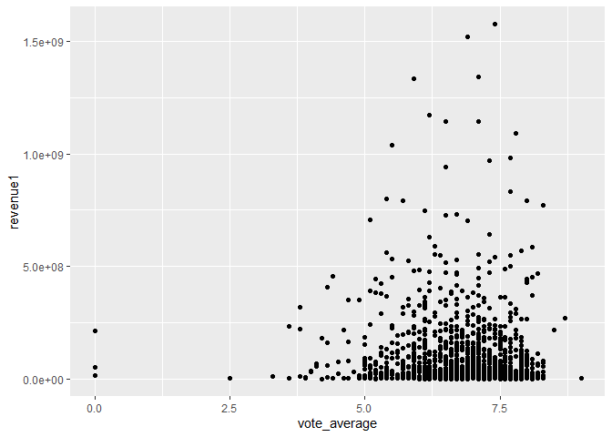<!-- -->

``` r
moviemonth = movies2 %>% ggplot(aes(month, revenue1))+ geom_boxplot()
moviemonth
```

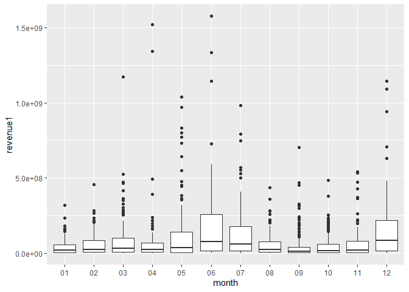<!-- -->

From the above analysis it appears that the highest grossing movies all
belong to a established franchise and therefore could be best predicted
by the popularity of the franchise. Because these films will skew the
RMSE to improve the model they can be removed (shown below). However, I
elected not to do so as I believe that the highest grossing movies would
also be of the highest interest to someone predicting revenues.

``` r
#outliers <- boxplot(movies2$revenue, plot=FALSE)$out
#movies2[which(movies2$revenue %in% outliers),]

#movies2 = movies2[-which(movies2$revenue %in% outliers),]

#glimpse(movies2)


#Set budget to NA if budget = 0
is.na(movies2$budget) <- movies2$budget <= .01
is.na(movies2$popularity) <- movies2$popularity <= .01
is.na(movies2$runtime) <- movies2$runtime <= .01
```

## All variables are created and we are ready to start prediction\!

First model is a linear regression model that will act as a baseline
comparison for more complex models.

## Split Data Into Train/Test and Create Recipe

``` r
#Split data into train and test
set.seed(100)
movie_split = movies2 %>% initial_split(prop = 0.8) #20% in test
movie_train = movie_split %>% training()
movie_test = movie_split %>% testing()


#Create recipe
movie_rec = recipe(revenue1 ~ original_title  + gender + month + year + id + budget  + original_language  + popularity +vote_average+ runtime + morethantwogenre
                  + Comedy + Drama  + Thriller  + Action + Animation  + Horror + Documentary  + Adventure + Crime + Mystery + Fantasy + Science_Fiction +
                  Romance + Music + Family + History,vote_count , data = movies2) %>% 
    update_role(id, new_role = "ID") %>%  
    update_role(original_title, new_role = "ID") %>%

#Normalize all predictors

step_normalize(all_predictors() & all_numeric()) %>% 

#Impute missing values using median

step_medianimpute(budget,popularity, runtime) %>%

#Create dummies

step_dummy(all_predictors() & all_nominal())

#Prep and juice

movie_df = movie_rec %>% prep() %>% juice()

#skim(movie_df)
```

``` r
#Create Workflow Recipe
wf <- workflow() %>%
  add_recipe(movie_rec)
```

## Linear Model

``` r
lm_mod <- linear_reg() %>% 
          set_engine("lm") #specift linear regression
lm_wf <- wf %>% add_model(lm_mod) #use all predictor variables in lm

lm_fit <- 
  lm_wf %>% 
  fit(data = movie_train) #fit model to training data
```

## Lasso Model

``` r
#Divide the training set into 10 folds for cross validation
movie_cv <-  movie_train %>% vfold_cv(v = 5)

#Specificy thtat this is a lasso by selecting mixture = 1
tune_spec <- linear_reg(penalty = tune(), mixture = 1) %>%
  set_engine("glmnet")

#Set lambdas (penalty for lasso)
lambdas = 10^seq(from = 10, to = -5, length = 100)

#Set seed for reproductability 
set.seed(9999)

#Create the grid
lasso_grid = tune_grid(
  wf %>% add_model(tune_spec),#Add model to workflow from linear reg
  resamples = movie_cv, #k fold validation
  grid = data.frame(penalty = lambdas),#call penalities
    metrics = metric_set(rmse) #looking to minimize rmse
)
```

## Table of the results for Lasso

``` r
lasso_grid %>%
  collect_metrics()
```

    ## # A tibble: 100 x 7
    ##      penalty .metric .estimator       mean     n  std_err .config               
    ##        <dbl> <chr>   <chr>           <dbl> <int>    <dbl> <chr>                 
    ##  1 0.00001   rmse    standard   114885330.     5 9306654. Preprocessor1_Model001
    ##  2 0.0000142 rmse    standard   114885330.     5 9306654. Preprocessor1_Model002
    ##  3 0.0000201 rmse    standard   114885330.     5 9306654. Preprocessor1_Model003
    ##  4 0.0000285 rmse    standard   114885330.     5 9306654. Preprocessor1_Model004
    ##  5 0.0000404 rmse    standard   114885330.     5 9306654. Preprocessor1_Model005
    ##  6 0.0000572 rmse    standard   114885330.     5 9306654. Preprocessor1_Model006
    ##  7 0.0000811 rmse    standard   114885330.     5 9306654. Preprocessor1_Model007
    ##  8 0.000115  rmse    standard   114885330.     5 9306654. Preprocessor1_Model008
    ##  9 0.000163  rmse    standard   114885330.     5 9306654. Preprocessor1_Model009
    ## 10 0.000231  rmse    standard   114885330.     5 9306654. Preprocessor1_Model010
    ## # ... with 90 more rows

## Graphical Results for Lasso

``` r
#Create graph of the relationship between rmse and lambda
lasso_grid %>%
  collect_metrics() %>% ggplot(aes(penalty, mean, color = .metric)) +
  geom_errorbar(aes(
    ymin = mean - std_err,
    ymax = mean + std_err #Add error bars
  ),
  alpha = 0.5
  ) +
  geom_line(size = 1.5) +
  facet_wrap(~.metric, scales = "free", nrow = 2) +
  scale_x_log10() +
  theme(legend.position = "none")
```

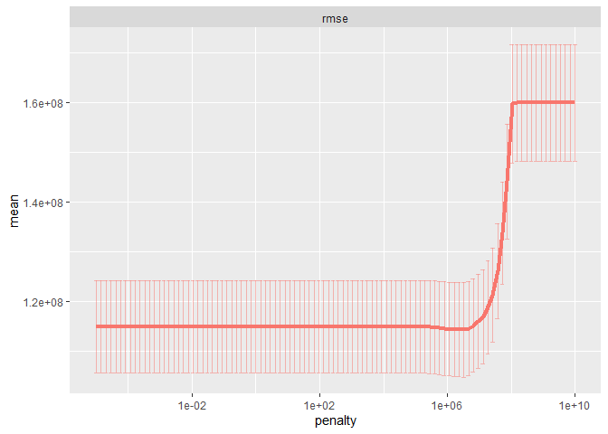<!-- -->

``` r
#Select best rmse and finalize workflow
lowest_rmse <- lasso_grid %>%
  select_best("rmse")

final_lasso <- finalize_workflow(
  wf %>% add_model(tune_spec),
  lowest_rmse
)

final_lasso
```

    ## == Workflow ====================================================================
    ## Preprocessor: Recipe
    ## Model: linear_reg()
    ## 
    ## -- Preprocessor ----------------------------------------------------------------
    ## 3 Recipe Steps
    ## 
    ## * step_normalize()
    ## * step_medianimpute()
    ## * step_dummy()
    ## 
    ## -- Model -----------------------------------------------------------------------
    ## Linear Regression Model Specification (regression)
    ## 
    ## Main Arguments:
    ##   penalty = 3274549.16287773
    ##   mixture = 1
    ## 
    ## Computational engine: glmnet

## Graphical Representation of Variable Importance

``` r
#Use vip package to pull the variable importance for the best model
final_lasso %>%
  fit(movie_train) %>%
  pull_workflow_fit() %>%
  vi(lambda = lowest_rmse$penalty) %>%
  mutate(
    Importance = abs(Importance),
    Variable = fct_reorder(Variable, Importance)
  )%>%
  ggplot(aes(x = Importance, y = Variable, fill = Sign)) +
  geom_col() +
  scale_x_continuous(expand = c(0, 0)) +
  labs(y = NULL)
```

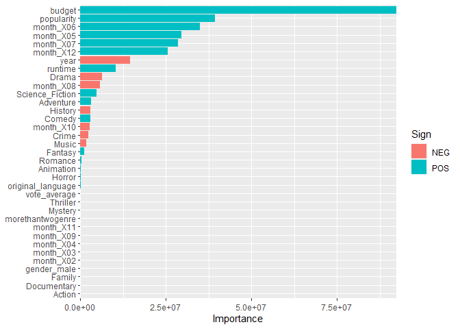<!-- -->

## Ridge Model

``` r
#Divide the training set into 10 folds for cross validation
movie_cv <-  movie_train %>% vfold_cv(v = 10)

#Specificy thtat this is a ridge by selecting mixture = 
tune_ridge <- linear_reg(penalty = tune(), mixture = 0) %>%
  set_engine("glmnet")

#Set lambdas (penalty for lasso)
lambdas = 10^seq(from = 5, to = -2, length = 100)

#Set seed for reproductability 
set.seed(2020)

#Create the grid
ridge_grid = tune_grid(
  wf %>% add_model(tune_ridge),#Add model to workflow from linear reg
  resamples = movie_cv, #k fold validation
  grid = data.frame(penalty = lambdas),#call penalities
    metrics = metric_set(rmse) #looking to minimize rmse
)
```

``` r
ridge_grid %>%
  collect_metrics()
```

    ## # A tibble: 100 x 7
    ##    penalty .metric .estimator       mean     n  std_err .config               
    ##      <dbl> <chr>   <chr>           <dbl> <int>    <dbl> <chr>                 
    ##  1  0.01   rmse    standard   114256619.    10 6874006. Preprocessor1_Model001
    ##  2  0.0118 rmse    standard   114256619.    10 6874006. Preprocessor1_Model002
    ##  3  0.0138 rmse    standard   114256619.    10 6874006. Preprocessor1_Model003
    ##  4  0.0163 rmse    standard   114256619.    10 6874006. Preprocessor1_Model004
    ##  5  0.0192 rmse    standard   114256619.    10 6874006. Preprocessor1_Model005
    ##  6  0.0226 rmse    standard   114256619.    10 6874006. Preprocessor1_Model006
    ##  7  0.0266 rmse    standard   114256619.    10 6874006. Preprocessor1_Model007
    ##  8  0.0313 rmse    standard   114256619.    10 6874006. Preprocessor1_Model008
    ##  9  0.0368 rmse    standard   114256619.    10 6874006. Preprocessor1_Model009
    ## 10  0.0433 rmse    standard   114256619.    10 6874006. Preprocessor1_Model010
    ## # ... with 90 more rows

``` r
#Select best rmse and finalize workflow
lowest_rmse <- ridge_grid %>%
  select_best("rmse")


final_ridge <- finalize_workflow(
  wf %>% add_model(tune_ridge),
  lowest_rmse
)

final_ridge
```

    ## == Workflow ====================================================================
    ## Preprocessor: Recipe
    ## Model: linear_reg()
    ## 
    ## -- Preprocessor ----------------------------------------------------------------
    ## 3 Recipe Steps
    ## 
    ## * step_normalize()
    ## * step_medianimpute()
    ## * step_dummy()
    ## 
    ## -- Model -----------------------------------------------------------------------
    ## Linear Regression Model Specification (regression)
    ## 
    ## Main Arguments:
    ##   penalty = 0.01
    ##   mixture = 0
    ## 
    ## Computational engine: glmnet

Best ridge is one with no penalty, this differs from both lasso and
elasticnet.

## Elasticnet Model

``` r
# Our range of λ and α
lambdas = 10^seq(from = 10, to = -10, length = 100)
alphas = seq(from = 0, to = 1, by = 0.1)
# Define the 5-fold split
#Set seed for reproductability 
set.seed(12345)
els_cv = movie_train %>% vfold_cv(v = 10)

#Set seed for reproductability 


# Define the elasticnet model
model_net = linear_reg(
  penalty = tune(), mixture = tune()
) %>% set_engine("glmnet")

#Define workflow


#Create the grid
els_grid = tune_grid(
  wf %>% add_model(model_net),#Add model to workflow from linear reg
  resamples = els_cv, #k fold validation
  grid = expand_grid(mixture = alphas, penalty = lambdas),#call penalities, add mixture to combine ridge and lasso
    metrics = metric_set(rmse) #looking to minimize rmse
)
```

``` r
#Quick overview of the results
els_grid %>%
  collect_metrics()
```

    ## # A tibble: 1,100 x 8
    ##     penalty mixture .metric .estimator      mean     n  std_err .config         
    ##       <dbl>   <dbl> <chr>   <chr>          <dbl> <int>    <dbl> <chr>           
    ##  1 1.00e-10       0 rmse    standard      1.13e8    10 7640466. Preprocessor1_M~
    ##  2 1.59e-10       0 rmse    standard      1.13e8    10 7640466. Preprocessor1_M~
    ##  3 2.54e-10       0 rmse    standard      1.13e8    10 7640466. Preprocessor1_M~
    ##  4 4.04e-10       0 rmse    standard      1.13e8    10 7640466. Preprocessor1_M~
    ##  5 6.43e-10       0 rmse    standard      1.13e8    10 7640466. Preprocessor1_M~
    ##  6 1.02e- 9       0 rmse    standard      1.13e8    10 7640466. Preprocessor1_M~
    ##  7 1.63e- 9       0 rmse    standard      1.13e8    10 7640466. Preprocessor1_M~
    ##  8 2.60e- 9       0 rmse    standard      1.13e8    10 7640466. Preprocessor1_M~
    ##  9 4.13e- 9       0 rmse    standard      1.13e8    10 7640466. Preprocessor1_M~
    ## 10 6.58e- 9       0 rmse    standard      1.13e8    10 7640466. Preprocessor1_M~
    ## # ... with 1,090 more rows

``` r
lowest_rmse <- els_grid %>%
  select_best("rmse")


final_els <- finalize_workflow(
  wf %>% add_model(model_net),
  lowest_rmse
)

final_els
```

    ## == Workflow ====================================================================
    ## Preprocessor: Recipe
    ## Model: linear_reg()
    ## 
    ## -- Preprocessor ----------------------------------------------------------------
    ## 3 Recipe Steps
    ## 
    ## * step_normalize()
    ## * step_medianimpute()
    ## * step_dummy()
    ## 
    ## -- Model -----------------------------------------------------------------------
    ## Linear Regression Model Specification (regression)
    ## 
    ## Main Arguments:
    ##   penalty = 14849682.6225446
    ##   mixture = 0.1
    ## 
    ## Computational engine: glmnet

Random Forest Model

``` r
#Create recipe
movie_rec = recipe(revenue1 ~ original_title  + gender + month + year + id + budget  + original_language  + popularity + vote_average + runtime  + morethantwogenre
                  + Comedy + Drama  + Thriller  + Action + Animation  + Horror + Documentary  + Adventure + Crime + Mystery + Fantasy + Science_Fiction +
                  Romance + Music + Family + History, data = movies2) %>% 
    update_role(id, new_role = "ID") %>%  
    update_role(original_title, new_role = "ID") %>%

#Normalize all predictors

step_normalize(all_predictors() & all_numeric()) %>% 

#Impute missing values using median

step_medianimpute(budget,popularity, runtime) %>%

#Create dummies

step_dummy(all_predictors() & all_nominal())

#Prep and juice

movie_df = movie_rec %>% prep() %>% juice()

#skim(movie_df)

#Bootstrap the model for cross validation

movie_boot = bootstraps(movie_train) #Use bootstraps for cv

#Set up specification for rf model
ranger_spec =
  rand_forest(mtry = tune(), min_n = tune(), trees = 100) %>% #set trees=100
  set_mode("regression") %>% #Regression not classification
  set_engine("ranger") #Use the ranger package

ranger_workflow =
  wf %>%
  add_model(ranger_spec) #add rf model to workflow

set.seed(5656)
ranger_tune <-
  tune_grid(ranger_workflow,
    resamples = movie_boot,#Use the bootstrapped sample, this takes a while to run
    grid = 11 #df size for tuning combinations
  )

show_best(ranger_tune, metric = "rmse") #show the best models based on rmse
```

    ## # A tibble: 5 x 8
    ##    mtry min_n .metric .estimator       mean     n  std_err .config              
    ##   <int> <int> <chr>   <chr>           <dbl> <int>    <dbl> <chr>                
    ## 1    15    12 rmse    standard   113933963.    25 2821364. Preprocessor1_Model05
    ## 2     8     2 rmse    standard   113982135.    25 2773348. Preprocessor1_Model11
    ## 3    12    27 rmse    standard   114160230.    25 2821777. Preprocessor1_Model03
    ## 4    17    21 rmse    standard   114460509.    25 2904514. Preprocessor1_Model04
    ## 5    20    35 rmse    standard   115979568.    25 2956846. Preprocessor1_Model08

This suggests that our random forest model performed better than the
lasso regression.

``` r
final_rf <- ranger_workflow %>% #Finalize workflow to get the best model
  finalize_workflow(select_best(ranger_tune)) #select best based on lowest rmse

final_rf
```

    ## == Workflow ====================================================================
    ## Preprocessor: Recipe
    ## Model: rand_forest()
    ## 
    ## -- Preprocessor ----------------------------------------------------------------
    ## 3 Recipe Steps
    ## 
    ## * step_normalize()
    ## * step_medianimpute()
    ## * step_dummy()
    ## 
    ## -- Model -----------------------------------------------------------------------
    ## Random Forest Model Specification (regression)
    ## 
    ## Main Arguments:
    ##   mtry = 15
    ##   trees = 100
    ##   min_n = 12
    ## 
    ## Computational engine: ranger

## Graphically analyze the variable importance

``` r
imp_spec <- ranger_spec %>%
  finalize_model(select_best(ranger_tune)) %>% #select the tune with the lowest rmse
  set_engine("ranger", importance = "permutation") #set engine

workflow() %>% 
  add_recipe(movie_rec) %>% #add recipe to workflow
  add_model(imp_spec) %>% #add best model
  fit(movie_train) %>% #fit to training data
  pull_workflow_fit() %>% #call variable importance
  vip(aesthetics = list(alpha = 0.8, fill = "midnightblue"))
```

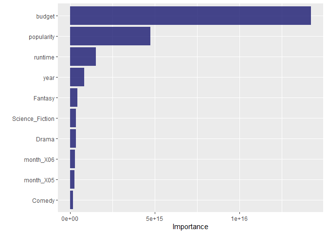<!-- --> The month
released was less important in the random forest model, and the runtime
was more important.

## Test the Results on the Test Set

## Linear Model

``` r
results_test <- lm_fit %>% #predict test values using the base linear model
  predict(new_data = movie_test) %>%
  mutate(
    truth = movie_test$revenue,
    model = "lm"
  ) 

results_test %>% rmse(truth = truth, estimate = .pred)
```

    ## # A tibble: 1 x 3
    ##   .metric .estimator  .estimate
    ##   <chr>   <chr>           <dbl>
    ## 1 rmse    standard   100120126.

## Lasso

``` r
l_fit = last_fit(final_lasso, movie_split) #Trains lasso model one last time on training data and evaluates on testing data
collect_metrics(l_fit)
```

    ## # A tibble: 2 x 4
    ##   .metric .estimator     .estimate .config             
    ##   <chr>   <chr>              <dbl> <chr>               
    ## 1 rmse    standard   108014034.    Preprocessor1_Model1
    ## 2 rsq     standard           0.512 Preprocessor1_Model1

``` r
collect_predictions(l_fit) %>% #Create a plot with revenue on the x axis and predicted revenue on the y axis
  ggplot(aes(revenue1, .pred)) +
  geom_abline(lty = 2, color = "gray50") +
  geom_point(alpha = 0.5, color = "blue") +
  coord_fixed()
```

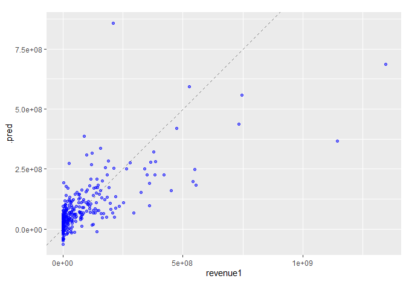<!-- -->

## Random Forest

``` r
rf_fit = last_fit(final_rf, movie_split) #Trains rf model one last time on training data and evaluates on testing data
collect_metrics(rf_fit)
```

    ## # A tibble: 2 x 4
    ##   .metric .estimator    .estimate .config             
    ##   <chr>   <chr>             <dbl> <chr>               
    ## 1 rmse    standard   91708154.    Preprocessor1_Model1
    ## 2 rsq     standard          0.669 Preprocessor1_Model1

``` r
collect_predictions(rf_fit) %>% #Create a plot with revenue on the x axis and predicted revenue on the y axis
  ggplot(aes(revenue1, .pred)) +
  geom_abline(lty = 2, color = "gray50") +
  geom_point(alpha = 0.5, color = "red") +
  coord_fixed()
```

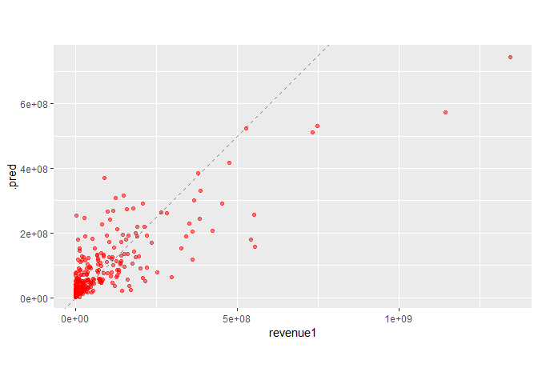<!-- -->

## Elasticnet

``` r
els_fit = last_fit(final_els, movie_split) #Trains els model one last time on training data and evaluates on testing data
collect_metrics(els_fit)
```

    ## # A tibble: 2 x 4
    ##   .metric .estimator     .estimate .config             
    ##   <chr>   <chr>              <dbl> <chr>               
    ## 1 rmse    standard   107591179.    Preprocessor1_Model1
    ## 2 rsq     standard           0.516 Preprocessor1_Model1

``` r
collect_predictions(els_fit) %>% #Create a plot with revenue on the x axis and predicted revenue on the y axis
  ggplot(aes(revenue1, .pred)) +
  geom_abline(lty = 2, color = "gray50") +
  geom_point(alpha = 0.5, color = "black") +
  coord_fixed()
```

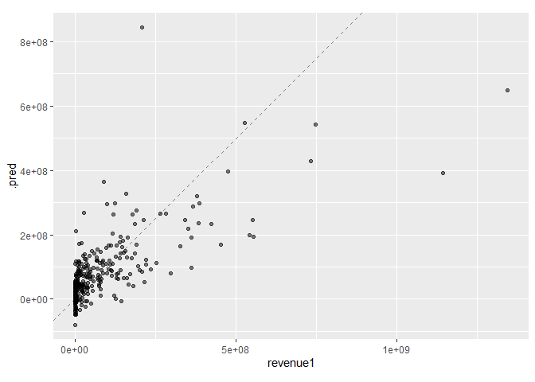<!-- --> \#\#
Ridge

``` r
ridge_fit = last_fit(final_ridge, movie_split) #Trains ridge model one last time on training data and evaluates on testing data
collect_metrics(ridge_fit)
```

    ## # A tibble: 2 x 4
    ##   .metric .estimator     .estimate .config             
    ##   <chr>   <chr>              <dbl> <chr>               
    ## 1 rmse    standard   107890203.    Preprocessor1_Model1
    ## 2 rsq     standard           0.513 Preprocessor1_Model1

``` r
collect_predictions(ridge_fit) %>% #Create a plot with revenue on the x axis and predicted revenue on the y axis
  ggplot(aes(revenue1, .pred)) +
  geom_abline(lty = 2, color = "gray50") +
  geom_point(alpha = 0.5, color = "purple") +
  coord_fixed()
```

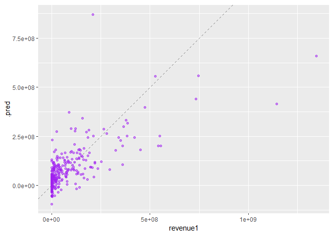<!-- -->
